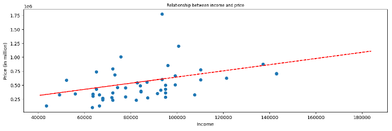

# Housing Estimates - Reddic Housing LLC

## Background

Reddic Housing LLC needs to generate house price estimatations for development firms. In order to stay competitive in the market, they decided to use machine learning techniques for this project.
Using the provided data by the client, our objective was to predict the price of houses as accurately as possible. The data was composed by historical housing prices and characteristics. The dataset includes features like square footage, number of bedrooms and bathrooms, location, age of the home, renovation year, etc.
Because the expected output was a numeric value within a large range, we identified this as a numerical/regression problem. In this order, we’ve employed a Gradient Boosted Regression Tree model to achieve our goal. We evaluated the model on the testing data and achieved an R-squared score of 0.91. This means the model explains about 91% of the variance in housing prices for the testing data.

## Methodology

For this project, we divided our tasks into five phases described below:
Data Analysis
We started out by looking for data to clean up. We noticed that some homes in the data were not renovated, so the "renovation year" column had values listed as 0 instead of something like "none." Having a 0 value could confuse our machine learning model because they weren't renovated in the year 0, so we removed that column from the data. We did the same thing with the basement square footage column for the same reasons.

### Initial Model

We split the data into a training set (80%) and a testing set (20%) to evaluate our model. We used the XGBRegressor model from XGB library to the training data. XGBRegressor uses a Gradient Boosted Regression Tree model under the hood that can predict continuous numeric values, like housing prices.

### Optimizing Model

Then we tested the model normalizing different columns with several different algorithms, but we weren't getting the results we wanted. We noticed that the model does not rely on the renovation year or basement square footage columns which could have potentially confused the results.

## Additional Insights

We found out that there is a trend that indicates that a house's final price is influenced by household median income, so we got the income data from an external source called "us zipcode", loop through the rows, and add the median household income by zip code.
We a scatter plot and a trend line we can better visualize it:

## Python Notebooks

Repository project:
[https://github.com/wmezadev/CSE-450-TEAM-4](https://github.com/wmezadev/CSE-450-TEAM-4)
